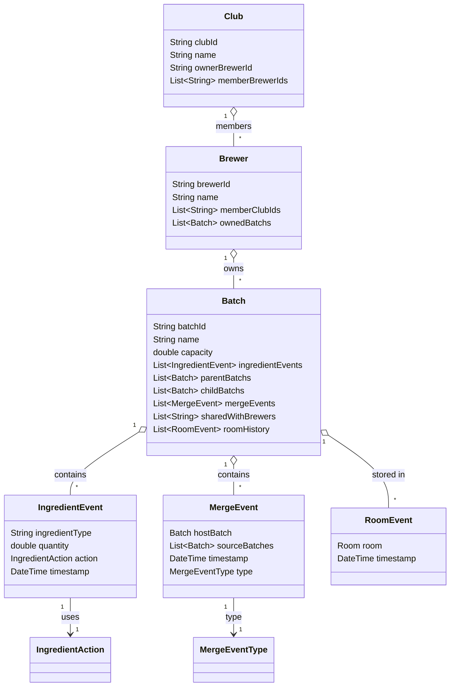

# YouBrewty Domain Model Diagram

```mermaid
classDiagram
    class Batch {
        String batchId
        String name
        double capacity
        List~IngredientEvent~ ingredientEvents
    List~Batch~ parentBatchs
    List~Batch~ childBatchs
        List~MergeEvent~ mergeEvents
        List~String~ sharedWithBrewers
        List~RoomEvent~ roomHistory
    }

    class IngredientEvent {
        String ingredientType
        double quantity
        IngredientAction action
        DateTime timestamp
    }

    class MergeEvent {
        Batch hostBatch
    List~Batch~ sourceBatches
        DateTime timestamp
        MergeEventType type
    }

    class RoomEvent {
        Room room
        DateTime timestamp
    }

    class Brewer {
        String brewerId
        String name
        List~String~ memberClubIds
        List~Batch~ ownedBatchs
    }

    class Club {
        String clubId
        String name
        String ownerBrewerId
        List~String~ memberBrewerIds
    }

    class IngredientAction
    class MergeEventType

    Batch "1" o-- "*" IngredientEvent : contains
    Batch "1" o-- "*" MergeEvent : contains
    Batch "1" o-- "*" RoomEvent : stored in
    IngredientEvent "1" --> "1" IngredientAction : uses
    MergeEvent "1" --> "1" MergeEventType : type
    Brewer "1" o-- "*" Batch : owns
    Club "1" o-- "*" Brewer : members
```